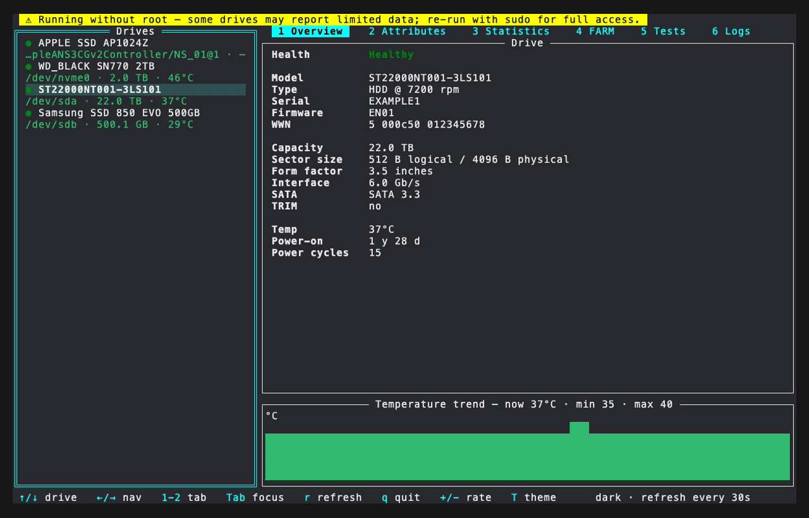
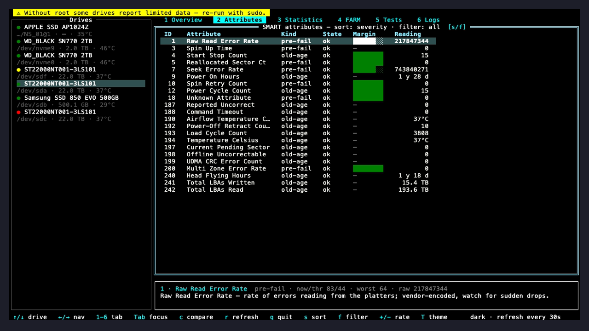
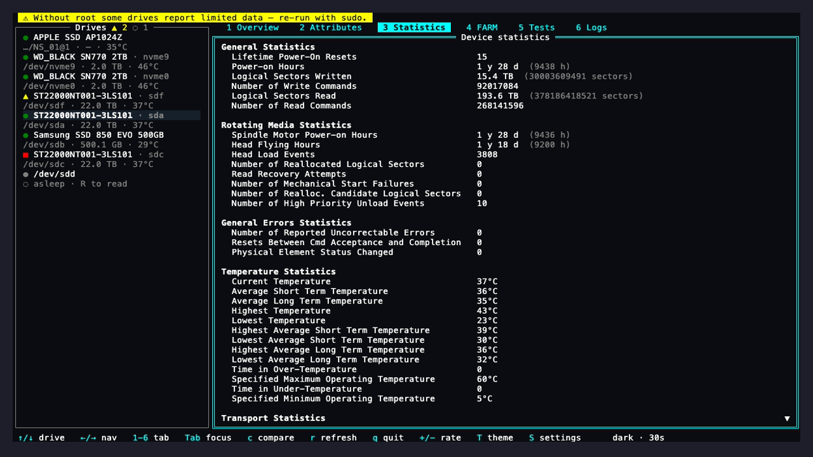
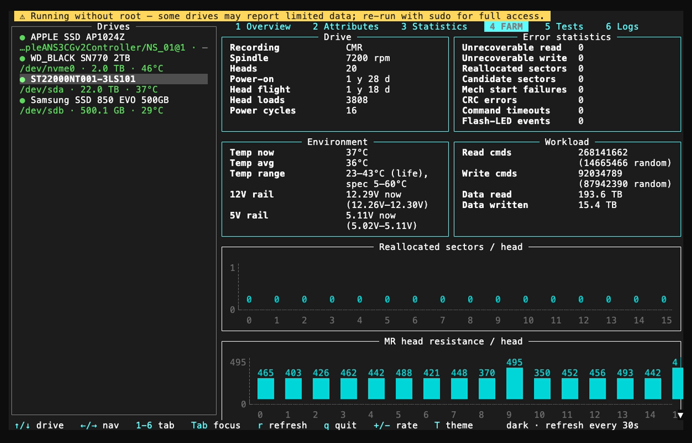
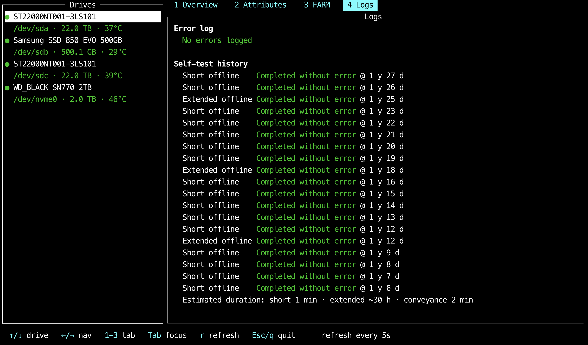
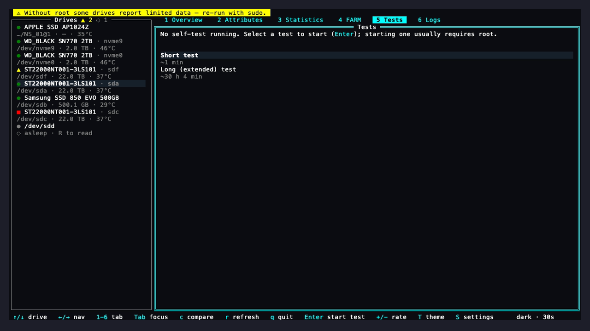
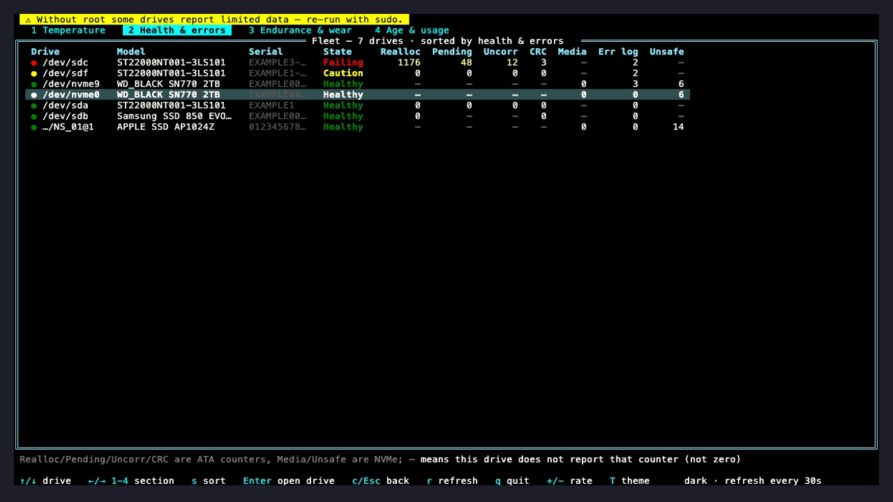

# smartview

A vibe-coded cross-platform terminal UI for monitoring drive health via
[smartmontools](https://www.smartmontools.org/). Runs on **macOS** and **Linux**,
showing SMART status, attributes, and wear indicators for SATA and NVMe drives in
a live, auto-refreshing dashboard.

Pick a drive on the left, then page through its tabs on the right — at a glance
you can tell whether a disk is healthy, how hot it's running, how worn an SSD is,
and whether anything has ever failed.



## Features

- **Live dashboard** — lists every drive with a colour-coded health glyph
  (🟢 OK / 🟡 warning / 🔴 failing), protocol, capacity, and temperature;
  auto-refreshes on an interval and can be refreshed on demand.
- **Per-drive drill-down** — a tabbed detail pane whose tabs appear only when the
  drive actually reports that data (see below). Includes drive identity, NVMe wear
  gauges (life left / spare available), and a temperature-trend sparkline.
- **SMART attribute table** — the full ATA attribute table or the NVMe health log,
  sorted by severity and coloured green / yellow / red, with a plain-language
  explanation of the selected attribute at the bottom.
- **Seagate FARM view** — for drives that expose Field Accessible Reliability
  Metrics, a richer reliability panel: error statistics, environment (temperature
  range, 12 V rail), workload counters, and per-head reallocated-sector and
  head-resistance charts.
- **Self-tests & error logs** — view the SMART error log and self-test history
  (short / extended / conveyance) with pass/fail status and estimated durations,
  and — on drives that support it — start short or extended self-tests right from
  the interactive **Tests** tab, with a live progress bar and cancel.
- **Failing/pre-fail highlighting** — uses smartmontools' authoritative
  `prefailure` flag plus `when_failed` / threshold checks, not name heuristics.
- **Graceful degradation** — the SMART JSON is sparse and drive-dependent (e.g.
  Apple internal SSDs report very little). Missing values render as `—` and whole
  tabs hide when a drive doesn't report that section.

### The tabs

Tabs are capability-driven — only the ones backed by real data for the selected
drive are shown.

**Overview** — drive identity (model, serial, firmware, capacity, interface,
power-on hours) and a live temperature-trend sparkline. ATA drives seed the
sparkline instantly from the on-disk temperature history; NVMe drives build it up
across polls.

**Attributes** — the per-drive SMART attributes, sorted by severity so anything
worrying floats to the top. Select a row to read what it means. Press `s` to
cycle the sort order and `f` to cycle the filter (e.g. only flagged attributes).



**Statistics** — the drive's own Device Statistics log, shown when it reports
one: lifetime power-on resets, logical sectors written and read, rotating-media
counters (head flight hours, load events, reallocation candidates), reported
uncorrectable errors, the full temperature history and transport counters.
Unlike the attribute table these are plain counters, not normalised values.



**FARM** — Seagate Field Accessible Reliability Metrics: unrecoverable read/write
counts, reallocated and candidate sectors, command timeouts, the drive's
temperature range and 12 V rail, workload (read/write command counts), and
per-head reallocated-sector and head-resistance charts.



**Logs** — the SMART error log and the self-test history (short / extended /
conveyance offline tests) with their results and estimated run times.



**Tests** — shown only on drives that support self-tests. Select a **Short** or
**Long (extended)** test and press `Enter` to start it (usually requires root);
a progress bar tracks the running test — filled cells, then the percentage and,
when the drive advertises a duration for that test type, an estimate of the time
left — and `x` cancels it. Results land in the **Logs** tab when the test completes.



### Fleet comparison

Press `c` for a full-screen comparison of every drive at once. One metric is in
focus at a time and the rows sort by it, so the drive you care about is at the
top: **Temperature** (current, min/max, trend sparkline), **Health & errors**
(verdict plus reallocated / pending / uncorrectable / CRC / media-error
counters), **Endurance & wear** (life used, spare, total written and writes per
day) and **Age & usage** (capacity, power-on time, power cycles, hours per
cycle). `←`/`→` or `1`–`4` switch sections, `s` flips between metric and device
order, and `Enter` opens the highlighted drive's detail view.

ATA and NVMe expose different counters, so a `—` means *this drive does not
report that reading* — never a zero. A write total shown as `~1.5 TB` was
derived from vendor attribute 241, whose unit is vendor-defined; the legend
under each section spells out that section's caveats.



## Requirements

- **Go 1.26+** (to build)
- **smartmontools 7.0+** providing `smartctl` with JSON output (`-j`)
  - macOS: `brew install smartmontools`
  - Debian/Ubuntu: `apt install smartmontools`
  - Fedora: `dnf install smartmontools`
  - Arch: `pacman -S smartmontools`

Full attribute access generally requires elevated privileges, so you may need to
run smartview with `sudo`.

## Install

Pre-built binaries are published for **macOS (Apple Silicon)** and
**Linux (x86-64)** on every release. smartmontools is a runtime dependency —
the Homebrew formula and the `.deb`/`.rpm` packages pull it in for you.

### Homebrew (macOS)

```sh
brew install trm42/tap/smartview
```

### Linux packages

Download the `.deb` or `.rpm` for your distro from the
[Releases page](https://github.com/trm42/smartview/releases) and install it:

```sh
sudo apt install ./smartview_*_linux_amd64.deb   # Debian/Ubuntu
sudo dnf install ./smartview-*_linux_amd64.rpm    # Fedora/RHEL
```

### Direct binary download

Grab the matching `tar.gz` from the
[Releases page](https://github.com/trm42/smartview/releases), extract it, and put
`smartview` on your `PATH`. Verify it against `checksums.txt`:

```sh
sha256sum -c checksums.txt --ignore-missing
```

Make sure smartmontools is installed (see [Requirements](#requirements)).

### From source (developers)

```sh
git clone https://github.com/trm42/smartview.git
cd smartview
go build -o smartview .
```

Or via the Go toolchain:

```sh
go install github.com/trm42/smartview@latest
```

Or run directly:

```sh
go run .
```

## Usage

```sh
smartview                    # auto-refresh every 30s (default)
smartview --interval 10s     # custom starting refresh interval
smartview --theme phosphor   # start in a named colour theme
smartview --version          # print the version and exit
sudo smartview               # if attributes require root
```

The refresh interval can also be changed at runtime with the `+` / `-` keys (see
below) — `--interval` only sets the starting cadence.

Five colour themes ship: `dark` (the default), `electric`, `phosphor`, `amber`
and `mono`. `--theme` picks the starting one and `T` cycles them live, in that
order. `phosphor` is a green-CRT palette in pure green, where severity reads as
brightness plus the `●` glyph rather than as hue; `amber` is a Hercules
amber-monitor palette with an amber → orange → red severity ramp; `mono` drops
colour entirely and leans on the glyph and bold alone.

### Keys

| Key                        | Action                                                        |
| -------------------------- | ------------------------------------------------------------- |
| `↑` / `↓`                  | Select a drive (list focus) or scroll content (detail focus)  |
| `j` / `k`                  | Scroll the focused content line by line                       |
| `PgUp` / `PgDn`, `Ctrl-B` / `Ctrl-F` | Page the scrollable content                       |
| `g` / `G`, `Home` / `End`  | Jump to the top / bottom of scrollable content                |
| `←` / `→`                  | Move between panes and step through detail tabs (no wrap)     |
| `Tab`                      | Toggle focus between the drive list and the detail pane       |
| `1`–`9`                    | Switch detail tab by number                                   |
| Click a tab                | Switch detail tab with the mouse                              |
| `t`                        | Jump straight to the **Tests** tab                            |
| `c`                        | Toggle the **Fleet** comparison (all drives side by side)     |
| `r`                        | Refresh now                                                   |
| `+` / `-`                  | Slower / faster refresh (2s → 5s → 10s → 30s → 1m → 5m ladder)|
| `T`                        | Cycle the colour theme                                        |
| `?`                        | Show every binding in a modal                                 |
| `s` / `f` (Attributes)     | Cycle the attribute sort / filter                             |
| `Enter` / `x` (Tests)      | Start the selected self-test / cancel the running test        |
| `1`–`4`, `←` / `→` (Fleet) | Switch the comparison section                                 |
| `s` / `Enter` (Fleet)      | Toggle metric/name sort · open the highlighted drive          |
| `Esc` (Fleet)              | Back to the per-drive view                                    |
| `q` or `Esc`               | Quit                                                          |

Below 100 columns the drive list collapses to a one-row rail and the detail
takes the full width; `↑` / `↓` then always step the drive, since there is no
list on screen for them to scroll. `?` shows the authoritative list: a test
parses the key handlers for the runes they match, and pins the named keys
alongside, so a binding cannot go undocumented.

Mouse is supported: click a tab in the detail strip, click a drive in the list,
and scroll any pane with the wheel. A tab click behaves exactly like `1`–`9` —
it selects the tab and moves keyboard focus to its body — and the tab bar itself
never takes focus. Below the width the full strip needs, inactive tabs shrink to
their numbers so every tab stays visible and clickable. The wheel over the tab
strip does nothing, and neither does a click on chrome that carries no keys (the
rail, the banner, the hint bar, the fleet's section strip) — it leaves the
keyboard where it was rather than stranding it.

### Dev / fixture mode

To eyeball the UI without real drives — or to render hardware you don't have on
hand — build with the `dev` tag and point `--fixtures` at a directory of captured
`smartctl -j -x` JSON:

```sh
go build -tags dev -o smartview .
./smartview --fixtures internal/smart/testdata   # render the committed fixtures
```

The committed `internal/smart/testdata/` fixtures cover ATA, NVMe, a sparse Apple
NVMe, and a Seagate FARM log. Fixture mode bypasses the `smartctl` preflight, so
smartmontools need not be installed. A plain release build (`go build`) still
accepts `--fixtures` but rejects it at startup with a rebuild hint.

## How it works

smartview shells out to `smartctl -j` rather than reading SMART data directly. This
keeps it cross-platform and lets smartmontools handle all device, transport, and
drive-database quirks (SATA / NVMe / SCSI bridges). One subtlety: `smartctl`'s exit
status is a bitmask that can be non-zero on a perfectly healthy drive, so smartview
parses the JSON regardless of exit code and surfaces real problems via
`smartctl.messages`.

```
internal/smart/   data layer — Scan/Info wrappers, typed JSON, health assessment
internal/ui/      tview UI — device pane, capability-driven tabs, poll loop
main.go           flags + smartctl preflight
```

The data layer is fully decoupled from the UI and has no tview dependency.

## Notes

* The content has been made with my server's disk's SMART data so other outputs may 
require additional visualisation work or tweaking. Please make PR's if it can improve
the app for your disks. 

## Development

What CI gates on, in the order it runs them:

```sh
gofmt -l .                                  # must print nothing
git ls-files '*.go' | xargs grep -L SPDX    # every .go file carries the header
go mod tidy && git diff --exit-code go.mod go.sum
go vet ./...
go vet -tags dev ./...
go build -o smartview .
CGO_ENABLED=0 GOOS=darwin GOARCH=arm64 go build -o /dev/null .   # release target
go build -tags dev -o /dev/null .           # the fixture build must keep compiling
go test -race -cover ./...
govulncheck ./...                           # pinned in the workflow, not @latest
golangci-lint run ./...                     # separate Lint workflow; .golangci.yml
goreleaser check                            # separate CI job; .goreleaser.yaml
```

The build/test job runs twice, against the toolchain in `go.mod` and against
`stable`.

`internal/smart` tests parse real captured `smartctl` output, including a sparse
Apple NVMe fixture that guards the graceful-degradation behaviour.
`internal/ui` is tested too: `layout_test.go` drives the whole application
headlessly on a tcell simulation screen (this is what catches layout and focus
regressions), `keys_test.go` fails if a bound key is missing from the `?` modal,
and `fleet_test.go` asserts on the first frame the fleet view draws.

One toolchain footgun: under Go 1.27.0 a bare `golangci-lint run` fails inside
the standard library with `undefined: rand (typecheck)` in
`crypto/internal/randutil`. Pin the toolchain to the version in `go.mod` and it
is clean:

```sh
GOTOOLCHAIN=go1.26.4 golangci-lint run ./...
```

## Roadmap

See [TODO.md](TODO.md). Self-test triggering (`smartctl -t`) and a
permission/sudo banner have landed, and the ATA and Seagate FARM paths have been
validated on real Linux SATA hardware.

**SCSI/SAS drives are not supported, on purpose.** smartview targets SATA/ATA and
NVMe only — we don't have SCSI/SAS hardware to develop or test against, so that
support is deliberately out of scope rather than merely pending.

## Built with

- [rivo/tview](https://github.com/rivo/tview) + [gdamore/tcell](https://github.com/gdamore/tcell) — terminal UI
- [navidys/tvxwidgets](https://github.com/navidys/tvxwidgets) — the NVMe
  percentage gauges (the charts and the temperature sparkline are drawn by
  `internal/ui/chart.go`, which scales to the data rather than to zero)
- [smartmontools](https://www.smartmontools.org/) — the SMART data source

## License

smartview is free software licensed under the **GNU General Public License
v3.0** or later. See [LICENSE](LICENSE) for the full text.

    smartview — terminal UI for monitoring drive health via smartmontools
    Copyright (C) 2026  smartview contributors

    This program is free software: you can redistribute it and/or modify
    it under the terms of the GNU General Public License as published by
    the Free Software Foundation, either version 3 of the License, or
    (at your option) any later version.

    This program is distributed in the hope that it will be useful,
    but WITHOUT ANY WARRANTY; without even the implied warranty of
    MERCHANTABILITY or FITNESS FOR A PARTICULAR PURPOSE.  See the
    GNU General Public License for more details.
